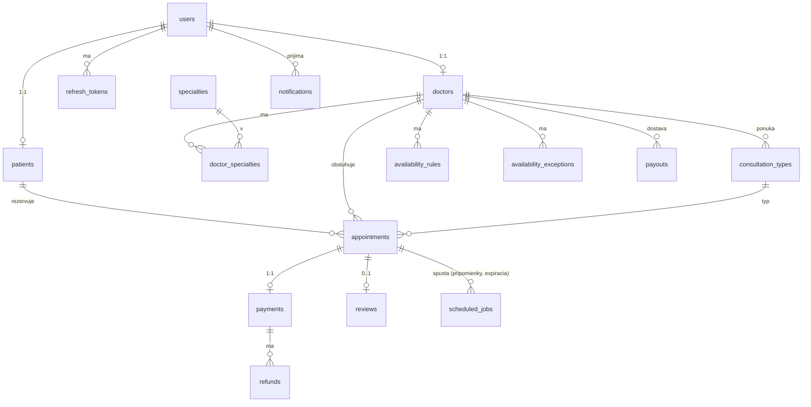
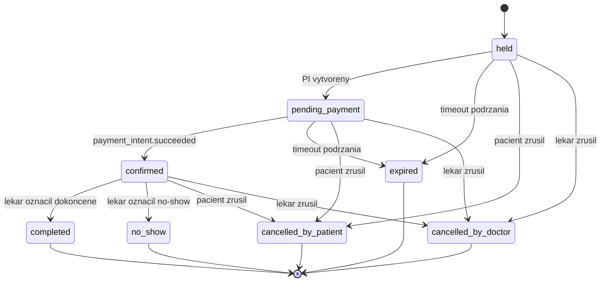
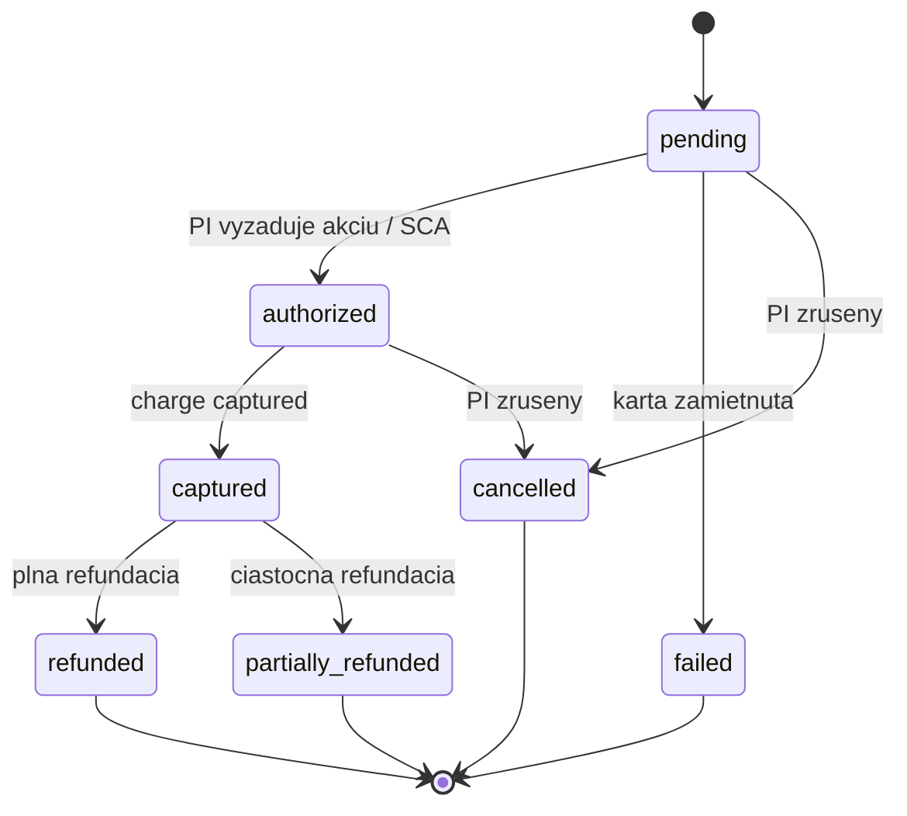

# MedBook — Architektúra backendu

**Poznámka autora:** Tento dokument popisuje backend pre MedBook, švajčiarsku platformu na rezerváciu termínov u lekárov-špecialistov. Návrh cieli na uvedený rozsah (500 lekárov / 50 000 pacientov / cca 2 000 rezervácií denne v špičke) bez zbytočného over-engineeringu, no je štruktúrovaný tak, aby zniesol 10× rast bez prepisovania. Každé rozhodnutie nižšie je vyhranené. Kompromisy sú uvedené, nie skryté.

---

## 0. Sumár stacku (TL;DR)

| Oblasť | Voľba | Jednoriadkové zdôvodnenie |
|---|---|---|
| Štýl API | REST + JSON | Nudné, cacheovateľné, priateľské voči viacerým klientom, čistý príbeh pre Stripe/Twilio webhooky. |
| Jazyk / framework | Python 3.12 + FastAPI | Silné typovanie cez Pydantic, async I/O pre fan-out webhookov, lacné na nábor. |
| Dátový sklad | PostgreSQL 16 | `tstzrange` + `EXCLUDE` constraint riešia dvojité rezervácie natívne. |
| Cache / zámky / broker frontu | Redis 7 | Cachovanie facetov vyhľadávania, idempotencia, distribuované zámky. |
| Úlohy na pozadí | Celery + Redis broker, s Postgres tabuľkou `scheduled_jobs` ako trvalým zdrojom pravdy | Prežije reštart workera; žiadne stratené pripomienky. |
| Object storage | S3 (švajčiarsky región — `eu-central-2` Zürich) | KYC dokumenty, fotky lekárov, šifrované at rest. |
| Autentifikácia | OAuth2 password grant + krátkožijúce JWT access + nepriehľadné refresh tokeny v DB | Revokovateľné, RBAC-friendly, pripravené na mobil. |
| Platby | Stripe Payment Intents + Stripe Connect + webhooky | Rieši SCA (povinné v CH/EU). |
| Video | Twilio Video — generovanie miestnosti + JWT access tokenov on demand | Žiadne ukladanie médií u nás. |
| Vyhľadávanie | Postgres `tsvector` + GIN + trigram | 500 lekárov → žiadny Elasticsearch. |
| Hosting | Kontajnery v švajčiarskom regióne (Exoscale Zürich alebo AWS `eu-central-2`) | Dátová rezidencia kvôli FADP. |

---

## 1. Návrh API

### 1.1 REST, nie GraphQL — a prečo

Volím REST. Zdôvodnenie:

1. **Webhooky dominujú zápisovým cestám.** Stripe a Twilio pushujú smerom k nám, nie naopak. Oba hovoria HTTP+JSON. GraphQL by zaviedol prekladovú vrstvu bez návratu hodnoty.
2. **Cacheovateľnosť.** Vyhľadávanie lekárov je najhorúcejšia čítaná cesta. REST GET-y krásne hrajú s HTTP cache, CDN, `ETag`/`If-None-Match`. GraphQL by potreboval Apollo persisted queries na dosiahnutie ekvivalentu.
3. **Dvaja klienti, čoskoro traja (web, iOS, Android).** Všetci sú dobre podporovaní OpenAPI codegenom. Nemáme problém N+1 fetchovania, ktorý GraphQL rieši.
4. **Auditovateľnosť.** Každý prechod stavu je jedna URL. Ľahšie sa premýšľa o RBAC, ľahšie sa loguje, ľahšie sa rate-limituje per route.

GraphQL by vyhral iba ak by frontend tímy potrebovali per-screen výber polí nad zložitým grafom. Nepotrebujú — najhlbší aggregate (profil lekára) sú dva joiny.

### 1.2 Autentifikácia

- **Access token:** JWT, RS256, TTL 15 minút. Claims: `sub` (user_id), `role` (`patient`/`doctor`/`admin`), `tenant`, `jti`, `exp`, `iat`. Podpísané kľúčovým párom rotovaným kvartálne; verejné kľúče servované na `/.well-known/jwks.json`.
- **Refresh token:** nepriehľadný náhodný 256-bitový, hashovaný (SHA-256) a uložený v `refresh_tokens` s `user_id`, `device_id`, `expires_at` (30 dní), `revoked_at`. Rotovaný pri každom použití (refresh token rotation); znovupoužitie spustí plnú revokáciu session pre daného používateľa — štandardná OAuth2 best practice.
- **RBAC:** rola vynútená na každom endpointe cez FastAPI dependency. Lekári môžu mutovať iba svoje vlastné zdroje; pacienti iba svoje; admini majú samostatný `/admin/*` router s prísnejším rate-limitom a IP allowlistom.
- **2FA:** povinná pre lekárov a adminov (TOTP). Voliteľná pre pacientov, ale odporúčaná.
- **Hashovanie hesiel:** Argon2id, `m=64MB, t=3, p=2`.

### 1.3 Skupiny endpointov

```
POST   /v1/auth/register                 (samoregistrácia pacienta)
POST   /v1/auth/doctor-apply             (žiadosť lekára, vstup do KYC)
POST   /v1/auth/login
POST   /v1/auth/refresh
POST   /v1/auth/logout
POST   /v1/auth/password-reset

GET    /v1/doctors                       (vyhľadávanie)
GET    /v1/doctors/{id}                  (profil)
GET    /v1/doctors/{id}/availability     (počítané sloty, range query)
PATCH  /v1/doctors/me
PUT    /v1/doctors/me/availability-rules
POST   /v1/doctors/me/availability-exceptions

GET    /v1/specialties

POST   /v1/appointments                  (podržanie slotu — idempotentné)
GET    /v1/appointments                  (vlastný zoznam)
GET    /v1/appointments/{id}
POST   /v1/appointments/{id}/confirm-payment
POST   /v1/appointments/{id}/cancel
POST   /v1/appointments/{id}/complete    (lekár)
POST   /v1/appointments/{id}/no-show     (lekár)

POST   /v1/payments/intents              (vytvorí Stripe PaymentIntent pre rezerváciu)
POST   /v1/payments/methods              (uloženie karty cez SetupIntent)
GET    /v1/payments/methods

POST   /v1/reviews                       (jedna na rezerváciu, 7-dňové okno)
GET    /v1/doctors/{id}/reviews

GET    /v1/admin/doctor-applications
POST   /v1/admin/doctor-applications/{id}/approve
POST   /v1/admin/doctor-applications/{id}/reject
GET    /v1/admin/disputes
POST   /v1/admin/refunds
GET    /v1/admin/analytics/*

POST   /v1/webhooks/stripe
POST   /v1/webhooks/twilio
```

Každý endpoint, ktorý mení stav, vyžaduje hlavičku `Idempotency-Key: <uuid>` (pozri §5.5).

### 1.4 Kritické request/response payloady

#### Vyhľadávanie lekárov

`GET /v1/doctors?specialty=cardiology&city=Zurich&consultation_type=video&max_price_chf=200&available_from=2026-05-06T00:00:00Z&available_to=2026-05-08T00:00:00Z&q=meier&page=1&page_size=20`

```json
{
  "page": 1,
  "page_size": 20,
  "total": 47,
  "results": [
    {
      "id": "doc_01HW...",
      "full_name": "Dr. Anna Meier",
      "specialties": ["cardiology"],
      "city": "Zurich",
      "languages": ["de", "en", "fr"],
      "consultation_types": [
        {"type": "in_person", "price_chf": 150},
        {"type": "video", "price_chf": 120}
      ],
      "rating_avg": 4.7,
      "rating_count": 132,
      "next_available_slot": "2026-05-06T09:00:00Z",
      "photo_url": "https://cdn.medbook.ch/d/01HW.../avatar.jpg"
    }
  ]
}
```

`next_available_slot` sa počíta z Redis cache pod kľúčom `doctor:{id}:next_slot` s 60s TTL; pri miss sa prepočíta z pravidiel + výnimiek + podržaných/rezervovaných slotov.

#### Získanie dostupnosti

`GET /v1/doctors/{id}/availability?from=2026-05-06&to=2026-05-13&consultation_type=video&tz=Europe/Zurich`

Sloty sa vracajú v UTC; parameter `tz` slúži iba na to, aby server vedel, ktoré kalendárne dni klienta zaujímajú.

```json
{
  "doctor_id": "doc_01HW...",
  "consultation_type": "video",
  "duration_minutes": 30,
  "slots": [
    {"start": "2026-05-06T07:00:00Z", "end": "2026-05-06T07:30:00Z", "status": "free"},
    {"start": "2026-05-06T07:30:00Z", "end": "2026-05-06T08:00:00Z", "status": "free"},
    {"start": "2026-05-06T08:00:00Z", "end": "2026-05-06T08:30:00Z", "status": "held"}
  ]
}
```

#### Vytvorenie rezervácie (podržanie)

`POST /v1/appointments`
Hlavičky: `Authorization: Bearer ...`, `Idempotency-Key: 0d2f...`

```json
{
  "doctor_id": "doc_01HW...",
  "consultation_type": "video",
  "slot_start": "2026-05-06T09:00:00Z",
  "slot_end": "2026-05-06T09:30:00Z",
  "notes": "Kontrola po echokardiograme"
}
```

201:

```json
{
  "id": "apt_01HX...",
  "status": "pending_payment",
  "doctor_id": "doc_01HW...",
  "patient_id": "pat_01HV...",
  "slot_start": "2026-05-06T09:00:00Z",
  "slot_end": "2026-05-06T09:30:00Z",
  "consultation_type": "video",
  "price_chf": 120,
  "hold_expires_at": "2026-05-05T11:15:00Z",
  "payment": {
    "client_secret": "pi_3Q...secret_xyz",
    "publishable_key": "pk_live_..."
  }
}
```

409 pri prehratom race (iný pacient získal rovnaký slot):

```json
{"error": "slot_unavailable", "message": "Tento slot už nie je dostupný."}
```

#### Potvrdenie platby (klientsky success callback — server však verí iba webhooku)

`POST /v1/appointments/{id}/confirm-payment`

```json
{ "payment_intent_id": "pi_3Q..." }
```

Vracia rezerváciu s jej **aktuálnym** stavom. Skutočný prechod na `confirmed` sa deje vo Stripe webhooku (§4.3); tento endpoint existuje iba preto, aby si klient mohol jedným dotazom vyzdvihnúť aktuálny stav a okamžite zobraziť správne UI bez čakania na ďalší refresh zoznamu.

#### Zrušenie

`POST /v1/appointments/{id}/cancel`

```json
{ "reason": "schedule_conflict" }
```

```json
{
  "id": "apt_01HX...",
  "status": "cancelled_by_patient",
  "refund": {
    "policy_applied": "12_to_24h_window",
    "refund_chf": 60,
    "refund_status": "pending"
  }
}
```

#### Zanechanie recenzie

`POST /v1/reviews`

```json
{
  "appointment_id": "apt_01HX...",
  "rating": 5,
  "title": "Výborné",
  "body": "Veľmi dôkladný prístup."
}
```

Validácia na strane servera: rezervácia musí byť `completed`, `now() <= completed_at + interval '7 days'`, a pre danú rezerváciu nesmie existovať žiadna predchádzajúca recenzia.

### 1.5 Chyby

Štandardný problem+json:

```json
{ "type": "about:blank", "title": "Slot unavailable", "status": 409, "code": "slot_unavailable", "trace_id": "..." }
```

---

## 2. Návrh databázy

### 2.1 ER prehľad



### 2.2 Schémy

Konvencie: ULID primárne kľúče (`text` s prefixom, napr. `pat_01HX...`); všetky timestampy `timestamptz`; mäkké zmazanie cez `deleted_at`; v klinicky relevantných tabuľkách nikdy neexekvujeme `DELETE`.

```sql
-- ====== Identita ======
CREATE TABLE users (
  id              text PRIMARY KEY,
  email           citext UNIQUE NOT NULL,
  password_hash   text NOT NULL,
  role            text NOT NULL CHECK (role IN ('patient','doctor','admin')),
  status          text NOT NULL DEFAULT 'active'
                  CHECK (status IN ('active','restricted','disabled')),
  totp_secret_enc bytea,
  created_at      timestamptz NOT NULL DEFAULT now(),
  updated_at      timestamptz NOT NULL DEFAULT now(),
  deleted_at      timestamptz
);

CREATE TABLE patients (
  id                 text PRIMARY KEY,
  user_id            text NOT NULL UNIQUE REFERENCES users(id),
  first_name_enc     bytea NOT NULL,           -- šifrované na úrovni poľa (§6.3)
  last_name_enc      bytea NOT NULL,
  dob_enc            bytea NOT NULL,
  phone_enc          bytea,
  preferred_tz       text NOT NULL DEFAULT 'Europe/Zurich',
  no_show_count      int NOT NULL DEFAULT 0,
  stripe_customer_id text,
  created_at         timestamptz NOT NULL DEFAULT now()
);

CREATE TABLE doctors (
  id                 text PRIMARY KEY,
  user_id            text NOT NULL UNIQUE REFERENCES users(id),
  full_name          text NOT NULL,
  bio                text,
  city               text NOT NULL,
  country            text NOT NULL DEFAULT 'CH',
  timezone           text NOT NULL,                 -- napr. 'Europe/Zurich'
  languages          text[] NOT NULL DEFAULT '{}',
  rating_avg         numeric(3,2) NOT NULL DEFAULT 0,
  rating_count       int NOT NULL DEFAULT 0,
  status             text NOT NULL DEFAULT 'pending'
                     CHECK (status IN ('pending','approved','suspended','rejected')),
  penalty_flags      int NOT NULL DEFAULT 0,
  stripe_account_id  text,                          -- Stripe Connect na výplaty
  created_at         timestamptz NOT NULL DEFAULT now()
);

CREATE TABLE specialties (
  id   text PRIMARY KEY,                            -- napr. 'cardiology'
  name text NOT NULL UNIQUE
);

CREATE TABLE doctor_specialties (
  doctor_id    text REFERENCES doctors(id),
  specialty_id text REFERENCES specialties(id),
  PRIMARY KEY (doctor_id, specialty_id)
);

CREATE TABLE consultation_types (
  id           text PRIMARY KEY,
  doctor_id    text NOT NULL REFERENCES doctors(id),
  kind         text NOT NULL CHECK (kind IN ('in_person','video','phone')),
  duration_min int NOT NULL CHECK (duration_min > 0),
  price_chf    numeric(10,2) NOT NULL CHECK (price_chf >= 0),
  active       boolean NOT NULL DEFAULT true,
  UNIQUE (doctor_id, kind)
);
```

### 2.3 Dostupnosť — pravidlá, výnimky, sloty počítané pri čítaní

Uvedená požiadavka: **nematerializovať 6 mesiacov slotov vopred.** Ukladáme pravidlá a výnimky; jeden riadok materializujeme až vtedy, keď pacient slot podrží alebo rezervuje.

```sql
-- opakujúci sa týždenný rozvrh
CREATE TABLE availability_rules (
  id                   text PRIMARY KEY,
  doctor_id            text NOT NULL REFERENCES doctors(id),
  consultation_type_id text NOT NULL REFERENCES consultation_types(id),
  weekday              smallint NOT NULL CHECK (weekday BETWEEN 0 AND 6), -- 0=Po
  start_local          time NOT NULL,                 -- v doctor.timezone
  end_local            time NOT NULL,
  effective_from       date NOT NULL,
  effective_until      date,
  CHECK (start_local < end_local)
);
CREATE INDEX ON availability_rules (doctor_id, weekday);

-- jednorazové override-y: dovolenky, dodatočné hodiny, blackout dni
CREATE TABLE availability_exceptions (
  id                   text PRIMARY KEY,
  doctor_id            text NOT NULL REFERENCES doctors(id),
  date_local           date NOT NULL,                  -- v doctor.timezone
  kind                 text NOT NULL CHECK (kind IN ('blackout','extra')),
  start_local          time,                           -- null pri kind='blackout' pre celý deň
  end_local            time,
  consultation_type_id text REFERENCES consultation_types(id),
  reason               text,
  created_at           timestamptz NOT NULL DEFAULT now()
);
CREATE INDEX ON availability_exceptions (doctor_id, date_local);
```

**Výpočet voľných slotov pri čítaní:**

1. Pre dotazovaný UTC rozsah `[from, to]` rozšírime do lokálnej tz lekára.
2. Pre každý lokálny dátum spravíme prienik: `(týždenné pravidlá ∩ weekday dňa) ∪ extra − blackouty`.
3. Každý interval rozdelíme podľa `consultation_type.duration_min`.
4. Odpočítame všetky riadky z `appointments`, ktorých status je v `('held','pending_payment','confirmed')` a ktorých `[slot_start, slot_end)` sa prekrýva.
5. Konvertujeme späť do UTC.

Výpočet je O(dni × pravidlá) — pre 7-dňové okno a 10 pravidiel na lekára sú to mikrosekundy. Výsledok cacheujeme s TTL 30s pod kľúčom `(doctor_id, from, to, type)`. Invalidujeme pri akomkoľvek zápise dostupnosti alebo rezervácie pre daného lekára.

### 2.4 Rezervácie — a záruka proti dvojitej rezervácii

Toto je nosná tabuľka.

```sql
CREATE EXTENSION IF NOT EXISTS btree_gist;

CREATE TYPE appointment_status AS ENUM (
  'held','pending_payment','confirmed','completed',
  'no_show','cancelled_by_patient','cancelled_by_doctor','expired'
);

CREATE TABLE appointments (
  id                   text PRIMARY KEY,
  doctor_id            text NOT NULL REFERENCES doctors(id),
  patient_id           text NOT NULL REFERENCES patients(id),
  consultation_type_id text NOT NULL REFERENCES consultation_types(id),
  status               appointment_status NOT NULL,
  slot                 tstzrange NOT NULL,             -- [slot_start, slot_end)
  price_chf            numeric(10,2) NOT NULL,
  hold_expires_at      timestamptz,                    -- nenull iba počas held / pending_payment
  twilio_room_sid      text,
  twilio_room_url      text,
  notes_enc            bytea,                          -- šifrované klinické poznámky, ak nejaké
  created_at           timestamptz NOT NULL DEFAULT now(),
  updated_at           timestamptz NOT NULL DEFAULT now(),
  cancelled_at         timestamptz,
  completed_at         timestamptz,

  -- TÁTO podmienka. Bráni dvom neterminálnym rezerváciám na prekrývajúcich sa
  -- intervaloch pre rovnakého lekára. Akékoľvek prekrytie zdvihne 23P01 exclusion_violation.
  CONSTRAINT no_overlap_per_doctor
    EXCLUDE USING gist (
      doctor_id WITH =,
      slot      WITH &&
    )
    WHERE (status IN ('held','pending_payment','confirmed','completed','no_show'))
);

CREATE INDEX appointments_doctor_slot_idx
  ON appointments USING gist (doctor_id, slot);
CREATE INDEX appointments_patient_idx
  ON appointments (patient_id, slot);
CREATE INDEX appointments_status_hold_expiry_idx
  ON appointments (status, hold_expires_at)
  WHERE status IN ('held','pending_payment');
```

`WHERE` klauzula na `EXCLUDE` constraint je zámerná: zrušenie zo strany pacienta musí slot uvoľniť pre niekoho iného. Zrušené a expirované riadky sú z kontroly prekrytia vylúčené, takže rovnaké časové okno môže byť opäť podržané.

#### Prečo presne tento mechanizmus

| Možnosť | Verdikt |
|---|---|
| `UNIQUE (doctor_id, slot_start)` | Odmieta iba presné kolízie. Nezabraňuje 30-min slotu prekryť 60-min slot. **Zamietnuté.** |
| `SELECT FOR UPDATE` na rodičovskom riadku `doctors` | Serializuje každú rezerváciu per lekár. Funguje, ale je to zlý primitív — pesimistický, head-of-line blocking pri async I/O do Stripe vnútri transakcie. **Zamietnuté.** |
| Redis `SETNX` zámok na `(doctor_id, slot_start)` | Užitočné ako *doplnková* vrstva pre soft serializáciu horúcich slotov (§5.1), ale nie autoritatívna; ak sa Redis pomýli, DB musí byť stále korektná. Opasok k traťam EXCLUDE. |
| Postgres advisory lock na `hashtext(doctor_id)` | Tá istá rola ako Redis zámok — neautoritatívna. |
| **`EXCLUDE USING gist (doctor_id =, slot &&)`** | **Autoritatívne, deklaratívne, indexované. Sama DB garantuje, že žiadne dve nezrušené rezervácie sa neprekryjú.** ✅ |

#### Stavový stroj rezervácie



### 2.5 Platby + refundácie + výplaty

```sql
CREATE TYPE payment_status AS ENUM (
  'pending','authorized','captured','failed','refunded','partially_refunded','cancelled'
);

CREATE TABLE payments (
  id                       text PRIMARY KEY,
  appointment_id           text NOT NULL UNIQUE REFERENCES appointments(id),
  stripe_payment_intent_id text NOT NULL UNIQUE,
  amount_chf               numeric(10,2) NOT NULL,
  status                   payment_status NOT NULL DEFAULT 'pending',
  last_event_at            timestamptz NOT NULL DEFAULT now(),
  failure_code             text,
  failure_message          text,
  created_at               timestamptz NOT NULL DEFAULT now()
);

CREATE TABLE refunds (
  id                  text PRIMARY KEY,
  payment_id          text NOT NULL REFERENCES payments(id),
  stripe_refund_id    text UNIQUE,
  amount_chf          numeric(10,2) NOT NULL,
  reason              text NOT NULL,        -- 'patient_cancel_>24h', 'doctor_cancel', atď.
  status              text NOT NULL CHECK (status IN ('pending','succeeded','failed')),
  created_at          timestamptz NOT NULL DEFAULT now()
);

CREATE TABLE payouts (
  id                  text PRIMARY KEY,
  doctor_id           text NOT NULL REFERENCES doctors(id),
  period_start        date NOT NULL,
  period_end          date NOT NULL,
  gross_chf           numeric(10,2) NOT NULL,
  fee_chf             numeric(10,2) NOT NULL,
  net_chf             numeric(10,2) NOT NULL,
  stripe_transfer_id  text UNIQUE,
  status              text NOT NULL CHECK (status IN ('pending','paid','failed')),
  created_at          timestamptz NOT NULL DEFAULT now()
);
```

#### Stavový stroj platby



Používame **automatic capture** Stripe Payment Intent vytvoreného na strane servera; v bežnom prípade sa "authorized → captured" zlúči do jednej webhook udalosti. Výplaty lekárov idú cez Stripe Connect s `application_fee_amount` nastaveným na 15 % per charge; týždenná agregácia v tabuľke `payouts` je pre náš vlastný reporting a rekonciliáciu.

### 2.6 Recenzie

```sql
CREATE TABLE reviews (
  id              text PRIMARY KEY,
  appointment_id  text NOT NULL UNIQUE REFERENCES appointments(id),
  patient_id      text NOT NULL REFERENCES patients(id),
  doctor_id       text NOT NULL REFERENCES doctors(id),
  rating          smallint NOT NULL CHECK (rating BETWEEN 1 AND 5),
  title           text,
  body            text,
  created_at      timestamptz NOT NULL DEFAULT now(),
  redacted_at     timestamptz
);
CREATE INDEX ON reviews (doctor_id) WHERE redacted_at IS NULL;
```

Oprávnenosť (v jednej transakcii pri inserte):

```sql
SELECT 1
FROM appointments a
WHERE a.id = $1
  AND a.patient_id = $2
  AND a.status = 'completed'
  AND a.completed_at >= now() - interval '7 days'
  AND NOT EXISTS (SELECT 1 FROM reviews r WHERE r.appointment_id = a.id);
```

`doctors.rating_avg` a `rating_count` sú aktualizované transakčne cez trigger, aby vyhľadávacia projekcia ostala konzistentná.

### 2.7 Podporné tabuľky

```sql
CREATE TABLE notifications (
  id            text PRIMARY KEY,
  user_id       text NOT NULL REFERENCES users(id),
  channel       text NOT NULL CHECK (channel IN ('email','sms','push')),
  template      text NOT NULL,
  payload_json  jsonb NOT NULL,
  scheduled_for timestamptz NOT NULL,
  sent_at       timestamptz,
  status        text NOT NULL DEFAULT 'pending'
                CHECK (status IN ('pending','sent','failed','cancelled')),
  attempts      int NOT NULL DEFAULT 0,
  last_error    text
);
CREATE INDEX ON notifications (status, scheduled_for) WHERE status='pending';

CREATE TABLE scheduled_jobs (
  id            text PRIMARY KEY,
  job_type      text NOT NULL,                   -- 'expire_hold', 'reminder_24h', atď.
  payload_json  jsonb NOT NULL,
  run_at        timestamptz NOT NULL,
  status        text NOT NULL DEFAULT 'pending'
                CHECK (status IN ('pending','running','done','failed','cancelled')),
  attempts      int NOT NULL DEFAULT 0,
  locked_by     text,
  locked_at     timestamptz
);
CREATE INDEX ON scheduled_jobs (status, run_at) WHERE status='pending';

CREATE TABLE audit_log (
  id          bigserial PRIMARY KEY,
  actor_id    text,
  actor_role  text,
  action      text NOT NULL,           -- 'appointment.cancel', 'doctor.approve', atď.
  entity      text NOT NULL,
  entity_id   text NOT NULL,
  before_json jsonb,
  after_json  jsonb,
  request_id  text,
  ip          inet,
  created_at  timestamptz NOT NULL DEFAULT now()
);
CREATE INDEX ON audit_log (entity, entity_id, created_at DESC);

CREATE TABLE idempotency_keys (
  key             text PRIMARY KEY,           -- "<user_id>:<route>:<client-key>"
  request_hash    text NOT NULL,              -- SHA256 kanonikalizovaného body
  response_status int,
  response_body   jsonb,
  created_at      timestamptz NOT NULL DEFAULT now(),
  expires_at      timestamptz NOT NULL DEFAULT now() + interval '24 hours'
);

CREATE TABLE processed_webhook_events (
  source       text NOT NULL,                 -- 'stripe' | 'twilio'
  event_id     text NOT NULL,
  processed_at timestamptz NOT NULL DEFAULT now(),
  PRIMARY KEY (source, event_id)
);
```

### 2.8 Indexy pre vyhľadávanie

```sql
ALTER TABLE doctors ADD COLUMN tsv tsvector
  GENERATED ALWAYS AS (
    setweight(to_tsvector('simple', coalesce(full_name,'')), 'A') ||
    setweight(to_tsvector('simple', coalesce(city,'')),      'B') ||
    setweight(to_tsvector('simple', coalesce(bio,'')),       'C')
  ) STORED;
CREATE INDEX doctors_tsv_idx ON doctors USING gin (tsv);
CREATE INDEX doctors_name_trgm_idx ON doctors USING gin (full_name gin_trgm_ops);
CREATE INDEX doctors_city_idx ON doctors (city) WHERE status='approved';
```

500 lekárov je málo. Postgres FTS + trigram odpovedá pod 2 ms. Elasticsearch by bol infraštruktúrny overhead bez viditeľného benefitu pre používateľa.

---

## 3. Používateľské toky

### 3.1 Rezervácia pacientom

```mermaid
sequenceDiagram
    participant P as Pacient
    participant API as FastAPI
    participant DB as Postgres
    participant S as Stripe
    participant T as Twilio
    participant W as Worker

    P->>API: GET /v1/doctors?...
    API->>DB: FTS + filtre (cache 30s)
    DB-->>API: lekari
    API-->>P: vysledky

    P->>API: GET /v1/doctors/{id}/availability
    API->>DB: pravidla u extra - blackouty - obsadene
    API-->>P: sloty

    P->>API: POST /v1/appointments + Idempotency-Key
    API->>DB: BEGIN
    API->>DB: INSERT appt(held, hold_expires_at = now()+15m)
    Note over DB: EXCLUDE constraint vynucuje neprekryvanie
    API->>S: PaymentIntent.create(idem=apt-pi-{id})
    S-->>API: pi_xxx + client_secret
    API->>DB: UPDATE appt status='pending_payment'
    API->>DB: INSERT scheduled_jobs(expire_hold, run_at=hold_expires_at)
    API->>DB: COMMIT
    API-->>P: 201 + client_secret

    P->>S: stripe.confirmCardPayment(client_secret) [3DS/SCA]
    S-->>P: succeeded

    S->>API: webhook payment_intent.succeeded
    API->>DB: dedupe processed_webhook_events
    API->>DB: BEGIN; payments.captured; appt.confirmed; hold_expires_at=NULL; COMMIT
    API->>T: rooms.create() (ak video)
    T-->>API: room_sid + url
    API->>DB: UPDATE appt twilio_room_*
    API->>W: enqueue potvrdenie, reminder_24h, reminder_1h
    W-->>P: notifikacie (push/email)
```

### 3.2 Onboarding lekára

```mermaid
sequenceDiagram
    participant D as Lekar
    participant API as FastAPI
    participant S3
    participant Adm as Admin

    D->>API: POST /v1/auth/doctor-apply
    API->>API: vytvori users(role=doctor, status=active), doctors(status=pending)
    API-->>D: presigned PUT URL (licencia, ID, poistka)
    D->>S3: PUT dokumenty (svajciarsky region, SSE-KMS)
    Adm->>API: GET /v1/admin/doctor-applications
    API->>S3: presigned GET (kratkozijuci) na review
    Adm->>API: POST .../approve  (alebo /reject s dovodom)
    API->>API: doctors.status='approved'; vyzaduje TOTP
    D->>API: PUT availability-rules; POST consultation_types
    Note over API: lekar viditelny vo vyhladavani WHERE status='approved'
```

Detaily KYC/overovania kvalifikácie:
- Nahratie licencie + manuálne porovnanie s registrom príslušnej kantonálnej lekárskej komory.
- Lekár si musí zaregistrovať TOTP, kým sa môže nasadiť do živej prevádzky.
- Stripe Connect Express onboarding link je odoslaný emailom pri schválení; lekár nemôže prijímať rezervácie, kým Connect nie je overený.

### 3.3 Zrušenie / refundácia

#### Iniciované pacientom

```
POST /v1/appointments/{id}/cancel
BEGIN
  SELECT * FROM appointments WHERE id=$1 AND patient_id=$2 FOR UPDATE;
  guard: status IN ('held','pending_payment','confirmed') inak 409
  Δ = slot_start - now()
  refund_pct =
    Δ > 24h  → 100
    Δ > 12h  → 50
    Δ ≤ 12h  → 0
  UPDATE appointments SET status='cancelled_by_patient', cancelled_at=now();
  IF status bol 'confirmed' AND refund_pct > 0:
    INSERT refunds(amount = price * refund_pct/100, status='pending');
COMMIT
ENQUEUE stripe.refund job (idempotency_key = refund.id)
NOTIFIKÁCIA pacient + lekár
```

#### Iniciované lekárom

```
POST /v1/appointments/{id}/cancel  (auth: lekár vlastní appt)
BEGIN
  UPDATE appointments SET status='cancelled_by_doctor', cancelled_at=now();
  IF platba captured:
    INSERT refunds(amount = plná cena, status='pending', reason='doctor_cancel');
  UPDATE doctors SET penalty_flags = penalty_flags + 1;
COMMIT
ENQUEUE stripe.refund job
NOTIFIKÁCIA pacient ("rezervácia zrušená — plná refundácia spustená")
```

#### No-show

Lekár volá `POST /appointments/{id}/no-show` po skončení slotu. Trigger inkrementuje `patients.no_show_count`. Keď `no_show_count >= 3`, zapíše sa záznam do `audit_log` a `users.status` sa prepne na `'restricted'` (login stále funguje, ale endpoint na rezerváciu vracia 403, kým admin príznak neuvoľní).

---

## 4. Tok dát

### 4.1 End-to-end trace rezervácie

1. **Frontend** vyšle `POST /v1/appointments` s `Idempotency-Key`.
2. **API gateway / load balancer** ukončí TLS, prepošle do FastAPI služby.
3. **FastAPI middleware:** auth, lookup idempotencie, rate limit (per user, per route).
4. **Booking služba** otvorí transakciu a vloží riadok rezervácie v stave `held`. `EXCLUDE` constraint je moment pravdy: `23P01` exclusion violation je preložená na HTTP 409.
5. Pri úspechu služba zavolá **Stripe** na vytvorenie Payment Intent (idempotency-keyed s `appointment_id`), uloží `stripe_payment_intent_id`, prepne `held → pending_payment`, commitne.
6. Tá istá transakcia vloží riadok do `scheduled_jobs(job_type='expire_hold', run_at=hold_expires_at)`. **Tá istá transakcia ako rezervácia** — ak commit prejde, expirácia je trvalá; ak zlyhá, žiadny osirelý job.
7. Odpoveď: 201 s `client_secret`.
8. Frontend dokončí Stripe.js confirmation priamo so Stripe (3DS/SCA môže používateľa odhodiť).
9. **Stripe** pošle `payment_intent.succeeded` na `/v1/webhooks/stripe`. Overíme podpis, dedupneme cez `processed_webhook_events`, prepneme rezerváciu na `confirmed`, vynulujeme `hold_expires_at` a (pre video) zavoláme **Twilio** na vytvorenie miestnosti.
10. Notifikácie a pripomienky sú zaradené v rovnakej transakcii.

### 4.2 Cache real-time dostupnosti

- Výsledky vyhľadávania: list-level cache pod kľúčom celej filtračnej n-tice, TTL 30s, Redis.
- `next_available_slot` per lekár: kľúč `doctor:{id}:next_slot`, TTL 60s, vyhadzovaný pri akomkoľvek zápise dostupnosti/rezervácie pre daného lekára.
- Slot detail (`GET /availability`): necacheujeme agresívne — prepočítavame; funkcia je lacná. Dávame iba 10s TTL cache na `(doctor_id, day, type)`, aby absorbovala refresh thrashing na profilovej stránke.

V cache nikdy nerezervujeme sloty — Postgres je autoritatívny. Redis je iba akcelerácia.

### 4.3 Stripe webhook handler — idempotencia

```mermaid
sequenceDiagram
    participant S as Stripe
    participant API as Webhook handler
    participant DB as Postgres
    participant T as Twilio

    S->>API: POST /v1/webhooks/stripe (event)
    API->>API: stripe.Webhook.construct_event(payload, sig)  [overenie podpisu]
    API->>DB: INSERT processed_webhook_events ON CONFLICT DO NOTHING
    alt uz spracovane
        API-->>S: 200
    else prvykrat
        API->>DB: SELECT appt FOR UPDATE
        alt status validny
            API->>DB: UPDATE payments.captured; UPDATE appt.confirmed
            API->>T: rooms.create() (ak video)
            T-->>API: room_sid
            API->>DB: UPDATE appt.twilio_*; INSERT reminder jobs
        else status invalidny (cancelled/expired)
            API->>API: enqueue refund (orphan capture)
        end
        API-->>S: 200
    end
```

Konkrétny handler:

```python
async def handle_stripe_webhook(req):
    payload = await req.body()
    sig     = req.headers["Stripe-Signature"]
    event   = stripe.Webhook.construct_event(payload, sig, STRIPE_WEBHOOK_SECRET)

    async with db.begin() as tx:                     # SERIALIZABLE
        # 1. dedupe
        inserted = await tx.execute(
            "INSERT INTO processed_webhook_events(source, event_id) "
            "VALUES ('stripe', :id) ON CONFLICT DO NOTHING",
            {"id": event["id"]},
        )
        if inserted.rowcount == 0:
            return Response(200)                     # uz spracovane

        # 2. dispatch
        if event["type"] == "payment_intent.succeeded":
            pi = event["data"]["object"]
            apt_id = pi["metadata"]["appointment_id"]

            row = await tx.execute(
                "SELECT status FROM appointments WHERE id=:id FOR UPDATE",
                {"id": apt_id},
            )
            if row.status not in ("pending_payment", "confirmed"):
                # zrusenie/expiracia vyhrali; refunduj orphan capture
                await schedule_refund(tx, pi["id"], reason="orphan_capture")
                return Response(200)

            await tx.execute(
                "UPDATE payments SET status='captured', last_event_at=now() "
                "WHERE stripe_payment_intent_id=:pi", {"pi": pi["id"]},
            )
            await tx.execute(
                "UPDATE appointments SET status='confirmed', "
                "  hold_expires_at=NULL, updated_at=now() "
                "WHERE id=:id", {"id": apt_id},
            )
            await schedule_post_confirm(tx, apt_id)   # twilio + notifikacie + pripomienky
        # ... payment_intent.payment_failed, charge.refunded, atd.

    return Response(200)
```

Tri vrstvy idempotencie:

1. Stripe `event.id` → `processed_webhook_events` PK (zahodí duplikované doručenia od Stripe).
2. Naša vlastná `Idempotency-Key` na booking POST → tabuľka `idempotency_keys` (zahodí duplikované klientske retries).
3. Stripe Payment Intent vytvorený s `idempotency_key=appointment_id` (zahodí duplikované Stripe API volania).

---

## 5. Spracovanie chýb

### 5.1 Súbežná rezervácia — hlavný problém

**Mechanizmus, od najlacnejšieho k autoritatívnemu:**

1. **Klientske UX:** obrazovka výberu slotu polluje dostupnosť; podržané sloty zmiznú iným pacientom do ~30s. Mäkké.
2. **Krátky Redis zámok** (voliteľne, viď nižšie).
3. **Postgres EXCLUDE constraint** — autoritatívne.

Pseudokód booking transakcie:

```python
async def hold_slot(patient_id, doctor_id, ctype_id, slot_start, slot_end, idem_key):
    if cached := await idem.get(idem_key):
        return cached

    slot = TstzRange(slot_start, slot_end, "[)")
    apt_id = ulid("apt")
    hold_expires = now() + timedelta(minutes=15)

    try:
        async with db.begin() as tx:
            # validuj, ze slot je v ramci pravidiel u extra - blackouty (chyti
            # pripad, ked stary klient skusil rezervovat mimo otvaracich hodin)
            if not await is_slot_offered(tx, doctor_id, ctype_id, slot):
                raise SlotInvalid()

            await tx.execute("""
                INSERT INTO appointments(
                  id, doctor_id, patient_id, consultation_type_id,
                  status, slot, price_chf, hold_expires_at)
                VALUES (:id, :doc, :pat, :ct,
                        'held', :slot, :price, :exp)
            """, ...)

            pi = await stripe.PaymentIntent.create(
                amount=int(price * 100),
                currency="chf",
                customer=patient.stripe_customer_id,
                automatic_payment_methods={"enabled": True},
                metadata={"appointment_id": apt_id},
                idempotency_key=f"apt-pi-{apt_id}",
            )

            await tx.execute(
                "INSERT INTO payments(...) VALUES (...)", ...)
            await tx.execute(
                "UPDATE appointments SET status='pending_payment' WHERE id=:id",
                {"id": apt_id})
            await tx.execute(
                "INSERT INTO scheduled_jobs(job_type, payload_json, run_at) "
                "VALUES('expire_hold', :p, :run)",
                {"p": {"appointment_id": apt_id}, "run": hold_expires})
    except UniqueViolation as e:
        if e.constraint_name == "no_overlap_per_doctor":
            raise HTTPException(409, "slot_unavailable")
        raise

    await idem.put(idem_key, response)
    return response
```

**Kompromisná diskusia:**

- Čisto DB prístup (zvolený): jeden round-trip do Postgres, constraint buď akceptuje alebo odmietne. Pri kontencii na jednom horúcom lekárovi obidva súbežné insertty dôjdu k constraint a jeden dostane `23P01`. Korektné, a zlyhania exclusion constraint sú lacné (~ms).
- **Redis zámok pod kľúčom `(doctor_id, slot_start)` s TTL 5s** ako oportunistická brána stojí za to len ak (a) Stripe API volanie vnútri transakcie začne dominovať latencii a (b) chceme zlyhať skôr ako sa k nemu dostaneme. Pri 2k rezerváciách denne v špičke je kontencia funkčne nulová — nasadil by som bez Redis zámku a pridal ho iba ak telemetria ukáže problém.
- **`SELECT FOR UPDATE` na riadku lekára** by serializoval všetky rezervácie per lekár — jednoduchšie, ale zavádza globálnu kritickú sekciu per lekár. S async I/O do Stripe vnútri transakcie je to antipattern, ktorý vyrába head-of-line blocking. Zamietnuté.

### 5.2 15-minútový timeout platby

Tri nezávislé vrstvy vynútenia, zámerne:

1. **Stripe Payment Intent** vytvorený bez explicitnej expirácie (Stripe expiruje intenty sám po 24h — samé osebe priveľa).
2. **`scheduled_jobs.expire_hold`** riadok vložený v rovnakej transakcii ako rezervácia, `run_at = hold_expires_at`.
3. **Worker** každých 5s polluje `scheduled_jobs WHERE status='pending' AND run_at <= now() FOR UPDATE SKIP LOCKED LIMIT 50`. Pre každý job: v transakcii znovu načíta rezerváciu; ak je stále `held` alebo `pending_payment`, prepne na `expired`, zruší Payment Intent (`stripe.PaymentIntent.cancel`, idempotency-keyed), uvoľní slot.

Ak je worker **dole**: rezervácie sa ďalej vytvárajú. Tabuľka `scheduled_jobs` zhromažďuje pending riadky; keď worker nabehne, drainuje backlog. Aby sme ohraničili najhorší prípad, pridáme defense-in-depth na úrovni API: pri inserte rezervácie tiež reapneme akýkoľvek predchádzajúci held riadok, ktorého `hold_expires_at` je v minulosti:

```sql
-- vnutri booking transakcie, pred novym INSERT
UPDATE appointments
   SET status='expired', updated_at=now()
 WHERE doctor_id = :doc
   AND slot && :slot
   AND status IN ('held','pending_payment')
   AND hold_expires_at < now() - interval '5 minutes';
```

Výsledok: aj s mŕtvym workerom je zvetraný hold zarezaný pri ďalšom súťažnom pokuse o rezerváciu. Dvojvrstvová obrana (worker + on-demand reaping) drží systém živý.

### 5.3 Zlyhanie platby uprostred rezervácie

Handler webhooku `payment_intent.payment_failed`:

1. Verify+dedupe.
2. Prepni `payments.status='failed'`, ulož `failure_code`, `failure_message`.
3. Rezervácia ostáva v `pending_payment`, kým neexpirre hold — pacient môže skúsiť platbu znova zavolaním `POST /v1/payments/intents` na tú istú rezerváciu, čo vytvorí *nový* PaymentIntent (starý je mŕtvy) bez znovuvytvárania rezervácie. To zachová rezerváciu slotu cez retries.
4. Pri expirácii holdu job `expire_hold` prepne rezerváciu na `expired`, zruší akýkoľvek otvorený intent a oznámi to pacientovi.

### 5.4 Externé služby dole

| Služba | Detekcia | Náhradné riešenie |
|---|---|---|
| **Stripe (vytvorenie intentu)** | API timeout / 5xx | Booking transakcia sa rollbackne. Pacient vidí "platobný systém nedostupný, skúste znovu". Slot *nie je* podržaný. Akceptovateľné: Stripe je na kritickej ceste; nezapisujeme fantómové holdy. |
| **Stripe (doručenie webhooku)** | Stripe automaticky retryuje s exponenciálnym backoffom až 3 dni; nikdy neočakávame jediné doručenie. | Idempotentný handler (§4.3). Ak je Stripe oneskorený, holdy expirujú — to je horšie pre pacienta než čakanie; mitigujeme nízkoprioritným reconcilerom, ktorý volá `stripe.PaymentIntent.retrieve()` na `pending_payment` rezerváciách starších ako 5 min. |
| **Twilio Video (vytvorenie miestnosti)** | 5xx / timeout | Rezervácia je už `confirmed` — to je deliverable pacienta. Vytvorenie miestnosti je zaradené ako úloha na pozadí, ktorá retryuje s backoffom až do T-30 min. Ak je Twilio *stále* dole v čase termínu, obe strany dostanú email s telefonickou náhradou. |
| **Email/SMS** | Provider 5xx | Tabuľka `notifications` retryuje s backoffom (1m, 5m, 15m, 1h). Pripomienky tiež retryujú; zmeškaná 24h pripomienka je degradovaná, ale nie katastrofická — 1h pripomienka stále vystrelí. |
| **Redis** | Connection failure | Brané ako cache miss; všetko ostatné stále funguje proti Postgres. Vyhľadávanie sa spomalí; to je jediný dopad. |

### 5.5 Idempotencia

- Každý `POST` a endpoint meniaci stav vyžaduje `Idempotency-Key`.
- Middleware ukladá `(user_id, route, key) → (request_hash, response)` v `idempotency_keys`.
- Replay s rovnakým hashom → vrátiť uložený response.
- Replay s **iným** hashom ale rovnakým key → 422 (`idempotency_key_reuse_with_different_payload`). Tvrdá obrana proti náhodnému znovupoužitiu kľúča na klientovi.
- Kľúče expirujú po 24h.

### 5.6 Neplatné prechody stavu

Prechody stavu žijú v jednej funkcii `transition(appointment, new_status)`, ktorej prvý riadok je ručne písaný allow-list:

```python
ALLOWED = {
  ("held","pending_payment"),
  ("held","expired"),
  ("pending_payment","confirmed"),
  ("pending_payment","expired"),
  ("pending_payment","cancelled_by_patient"),
  ("confirmed","completed"),
  ("confirmed","no_show"),
  ("confirmed","cancelled_by_patient"),
  ("confirmed","cancelled_by_doctor"),
  ("held","cancelled_by_patient"),
  ("held","cancelled_by_doctor"),
  ("pending_payment","cancelled_by_doctor"),
}
```

Akýkoľvek iný prechod zdvihne `InvalidStateTransition` → HTTP 409. Postgres má aj trigger, ktorý odmietne aktualizácie nepatriace do tohto allow-listu — opasok-a-traky proti priamym DB zápisom (admin opravy, skripty).

---

## 6. Prierezové oblasti

### 6.1 Pripomienky

Trvalé. Vložené do `scheduled_jobs` pri potvrdení rezervácie:

```sql
-- vnutri rovnakej TX ako potvrdenie appt
INSERT INTO scheduled_jobs(job_type, payload_json, run_at) VALUES
  ('reminder_24h', :p, slot_start - interval '24 hours'),
  ('reminder_1h',  :p, slot_start - interval '1 hour');
```

Workery polujú s `FOR UPDATE SKIP LOCKED`. Zrušenie rezervácie ruší zodpovedajúce pending joby v rovnakej transakcii. Pripomienky zmeškané kvôli pádu workera (`run_at < now()` pri starte) sú stále vystrelené, ale označené `late=true` — lepšie poslať oneskorenú pripomienku ako žiadnu.

### 6.2 Časové pásma

- `doctors.timezone` IANA názov (`Europe/Zurich`).
- `availability_rules.start_local`, `end_local` sú wall-clock v tz lekára.
- `availability_exceptions.date_local` je lokálny dátum lekára.
- `appointments.slot` je `tstzrange` v UTC.
- `patients.preferred_tz` sa zohľadňuje iba pre **zobrazenie** v API odpovediach, kde je to užitočné (napr. renderovanie notifikácií). Všetky API timestampy sú UTC ISO-8601 so `Z`.

DST: pri rozšírení pravidiel konvertujeme local→UTC cez `pg_timezone_names`/`AT TIME ZONE`, takže 09:00 lokálny slot je správny na oboch stranách DST prechodu. Sloty padajúce do diery pri spring-forward jednoducho vynechávame; sloty v zdvojenej hodine pri fall-back *neduplikujeme* (druhý výskyt považujeme za neponúknutý).

### 6.3 GDPR / švajčiarsky FADP / PII

Zdravotné údaje pacientov sú vysoko citlivé. Konkrétne:

- **Šifrovanie at rest:** Postgres na šifrovaných volumoch (KMS-managed). S3 buckety SSE-KMS.
- **Šifrovanie na úrovni poľa** pre priame PII (`first_name_enc`, `last_name_enc`, `dob_enc`, `phone_enc`, `notes_enc`). Envelope encryption: per-row dátový kľúč šifrovaný pod KMS CMK. Uložené ako `bytea` s malou hlavičkou. Aplikácia dešifruje in-process; logy a DB zálohy obsahujú iba ciphertext.
- **TLS 1.2+** medzi každým komponentom. mTLS medzi API ↔ workermi ↔ DB.
- **Dátová rezidencia:** všetky primárne sklady vo Švajčiarsku alebo EU (`eu-central-2` Zürich preferované).
- **Audit log:** každé čítanie údajov pacienta adminom je zalogované v `audit_log` s `actor_id`, IP, request id.
- **Právo na výmaz:** **nehard-deletujeme**. `users.deleted_at` sa nastaví; PII polia sa vynulujú a nahradia tombstoneom (`first_name_enc = E'\\x00'`, atď.); riadky rezervácií sú zachované pre klinické/finančné účely (švajčiarsky zákon vyžaduje 10 rokov pre faktúry). Recenzie sú anonymizované na "Bývalý pacient". Toto je kompromis medicínskeho kontextu: výmaz-anonymizáciou, nie drop riadku.
- **Subject access requests:** admin nástroj dumpne všetky riadky tagované `user_id`, dešifruje PII, vyrobí JSON+PDF balík. SLA: 30 dní.
- **DPA / zoznam spracovateľov:** Stripe (platby), Twilio (video), email/SMS provider (Postmark, Twilio Messaging) — všetky uvedené v privacy policy.
- **Retencia:** platby a rezervácie 10 rokov; access logy 1 rok; raw notifikácie 90 dní.

### 6.4 Vyhľadávanie — opätovné potvrdenie "nepretáčaj"

500 lekárov. Postgres `tsvector` + GIN + trigram + `pg_trgm` pre fuzzy matche zvládne každý reálny dotaz pod 5 ms. **Žiadny Elasticsearch.** Prehodnotiť pri 50k lekároch alebo keď faceted agregácie začnú dominovať latencii.

### 6.5 Observabilita

- Štruktúrované logy (JSON), korelačné ID propagované cez každú vrstvu (`X-Request-Id`).
- Metriky: Prometheus (rate rezervácií, rate expirácie holdov, rate 23P01 za minútu, lag Stripe webhookov, lag scheduled_jobs).
- Distribuovaný tracing: OpenTelemetry, vzorkované na 10 %, 100 % pri chybách.
- Alerty: lag scheduled_jobs > 5 min, exclusion violations rastú (môže znamenať clock skew alebo duplicitné requesty z frontendu), lag Stripe webhookov > 5 min, zlyhania payout jobov.

### 6.6 Deploy / škálovanie

- Stateless API za ALB; horizontálny autoscaling podľa rate requestov.
- Dva worker pooly: `default` a `webhooks` (webhooky nesmú byť nikdy hladované burstami pripomienok).
- Postgres: primary + 1 sync replica + 1 async read replica. Vyhľadávacie a analytické dotazy idú na async replicu.
- Zálohovanie: denný base + WAL-G continuous archiving; PITR cieľ ≤ 5 min.
- Blue/green deploy s gatovaním DB migrácií: každá migrácia musí byť online-safe (žiadne exkluzívne zámky na horúcich tabuľkách; používaj `CREATE INDEX CONCURRENTLY`, multi-step zmeny typov).

---

## 7. Otvorené otázky / vyjasnené follow-upy

1. **Stripe Connect Express vs. manuálne transfery** pre výplaty lekárov: odporúča sa Connect Express (KYC rieši Stripe, rýchlejší onboarding). 15% platformový poplatok je zachytávaný per charge cez `application_fee_amount`, s týždennou agregáciou v tabuľke `payouts` pre náš vlastný reporting a rekonciliáciu.
2. **Lekári v multi-clinic režime** (lekár pracujúci pre dve ambulancie): mimo rozsahu tohto návrhu. Triviálne rozšírenie cez tabuľku `clinics` + join `doctor_clinics`; pravidlá dostupnosti sa stanú per-clinic.
3. **Rodinné účty pacientov** (rezervácia v mene dieťaťa): mimo rozsahu; vyžadovalo by tabuľku `dependents` a explicitný consent flow.
4. **Waiting list pre osobné konzultácie** (uvoľnený slot → notifikuj radu): pridalo by tabuľku `waitlist` a reaktor na slot-free události. Odporúčané pre v1.1.
5. **i18n šablón a admin nástrojov** (DE/FR/IT/EN): predpokladané, ale tu nedetailované.

---
